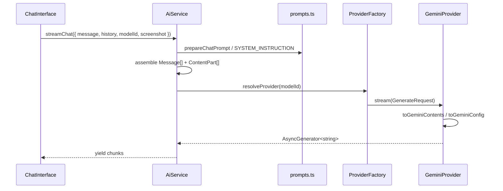

# Architecture Plan

## Current System Context

```
src/api/
├── gemini.ts      # Provider + logic + features + errors + auth (337 lines)
└── prompts.ts     # System instructions and prompt builders

src/components/
├── ChatInterface.tsx           # imports geminiClient directly
└── ExpandedSelectionPopup.tsx  # imports geminiClient directly

src/constants/chat.ts           # CHAT_MODELS (Gemini IDs only)
src/types/chat.ts               # ChatMessage imported from gemini.ts
```

**Known bug:** `ChatInterface` adds the user turn to `history`, then `sendChatMessageStream` appends the same prompt again — duplicate user message sent to Gemini.

**Dependencies:** `@google/genai` only. No OpenAI or Anthropic SDKs yet.

## Proposed Design

Two layers plus shared core types, under `src/ai/`:

```
src/ai/
├── index.ts                      # Public exports for components
├── types.ts                      # Universal Message, ContentPart, GenerateRequest
├── errors.ts                     # AiError, getReadableAiError
├── auth.ts                       # resolveApiToken(providerId), storage keys
├── models.ts                     # AI_MODELS registry, getModelById, resolveProvider
├── prompts.ts                    # moved from src/api/prompts.ts
├── ai-service.ts                 # Layer 2 — streamChat, sendInlineQuestion, etc.
└── providers/
    ├── provider.interface.ts     # AiProvider interface
    ├── base-provider.ts          # Shared cache helper
    ├── gemini.provider.ts        # Layer 1 — Gemini
    ├── openai.provider.ts        # Layer 1 — future
    ├── anthropic.provider.ts     # Layer 1 — future
    └── factory.ts                # createProvider, resolveProviderForModel
```

### Data flow



## Boundaries and Invariants

1. **Components import only from `@/ai`** (AiService, auth helpers, errors, model registry).
2. **Prompts and system instructions live in Layer 2** (`prompts.ts`, `ai-service.ts`) — never in provider adapters.
3. **Providers accept `GenerateRequest` and return text** — no knowledge of Creep features (inline Q, page content blocks, etc.).
4. **Attachments use universal `ContentPart`** — providers map to SDK formats internally.
5. **Model ID is provider-native** (e.g. `models/gemini-2.5-flash`, `gpt-4o`) — factory resolves provider from registry.
6. **Streaming returns `AsyncGenerator<string>`** — preserves existing UI consumption pattern.
7. **Caching applies only to idempotent `generate()` calls** — never stream.
8. **Errors thrown as `AiError`** with `code`, `provider`, optional `raw` — UI uses `getReadableAiError`.

## Components

### `types.ts`

- **Responsibility:** Universal contract between layers.
- **Inputs/outputs:** `ContentPart`, `Message`, `GenerateRequest`, `AiModel`, `ProviderCapabilities`.
- **Failure modes:** Invalid attachment MIME types caught at assembly time in AiService.

### `provider.interface.ts` / `AiProvider`

- **Responsibility:** Define adapter contract.
- **Methods:** `generate()`, `stream()`, `getCapabilities(model)`.
- **Failure modes:** Missing token, SDK errors → throw `AiError`.

### `gemini.provider.ts`

- **Responsibility:** Translate universal request ↔ `@google/genai` SDK.
- **Inputs:** `GenerateRequest`.
- **Outputs:** `string` or `AsyncGenerator<string>`.
- **Failure modes:** Region unsupported, quota, auth — mapped in `errors.ts`.
- **Special:** `tools: [{ type: "web_search" }]` → `{ googleSearch: {} }`.

### `ai-service.ts`

- **Responsibility:** Creep feature logic.
- **Inputs:** Feature-specific options (`StreamChatOptions`, etc.).
- **Outputs:** Same as today (streams, promises, prompt pairs).
- **Failure modes:** Delegates to provider; wraps with context if needed.

### `factory.ts`

- **Responsibility:** Singleton provider instances; model → provider routing.
- **Failure modes:** Unknown model ID → fallback to default model or throw.

## Alternatives Considered

| Alternative | Why not |
|---|---|
| **Third-party multi-LLM lib** (omni-llm, llm-bridge) | Bundle size, Gemini Search tool, BYOK pattern, less control over extension-specific errors |
| **Single mega-client with switch(provider)** | Grows unbounded; violates separation; hard to test |
| **OpenAI format as lingua franca** | Anthropic/Gemini need lossy translation; universal minimal format is simpler |
| **Backend proxy for all providers** | Out of scope; changes deployment and auth model |

## Provider Translation Reference

When implementing OpenAI and Anthropic adapters, map the same `GenerateRequest`:

### Gemini (Phase 1)

| Universal | Gemini SDK |
|---|---|
| `system` | `config.systemInstruction` |
| `{ type: "text" }` | `{ text }` |
| `{ type: "image" }` | `{ inlineData: { mimeType, data } }` |
| `{ type: "audio" }` | `{ inlineData: { mimeType, data } }` |
| `tools: [{ type: "web_search" }]` | `tools: [{ googleSearch: {} }]` |
| `stream: true` | `generateContentStream` |

### OpenAI (Phase 4)

| Universal | OpenAI SDK |
|---|---|
| `system` | system message or `instructions` |
| `{ type: "image" }` | `{ type: "input_image", image_url: "data:...;base64,..." }` |
| `{ type: "audio" }` | `{ type: "input_audio", input_audio: { data, format } }` on audio-capable models |
| Stream | `chat.completions.create({ stream: true })` |

Docs: [Images and vision](https://developers.openai.com/api/docs/guides/images-vision), [Audio](https://developers.openai.com/api/docs/guides/audio)

### Anthropic (Phase 4)

| Universal | Anthropic SDK |
|---|---|
| `system` | top-level `system` param |
| `{ type: "image" }` | `{ type: "image", source: { type: "base64", media_type, data } }` |
| `{ type: "audio" }` | Not native — use Whisper/Gemini transcription fallback |
| Stream | `client.messages.stream` |

Docs: [Messages API](https://platform.claude.com/docs/en/build-with-claude/working-with-messages)
